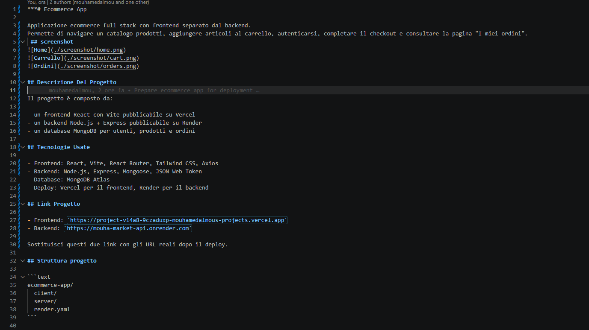
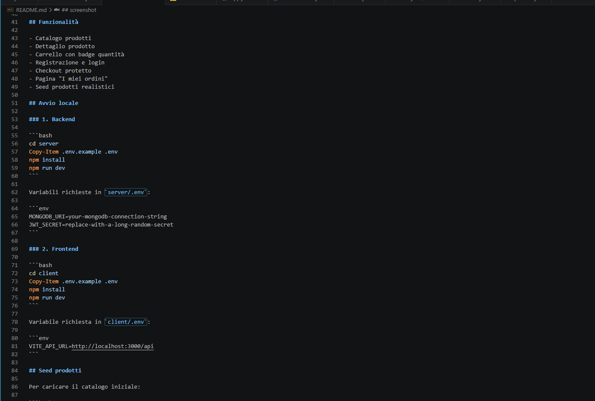

***# Ecommerce App

Applicazione ecommerce full stack con frontend separato dal backend.
Permette di navigare un catalogo prodotti, aggiungere articoli al carrello, autenticarsi, completare il checkout e consultare la pagina "I miei ordini".
 ## screenshot




## Descrizione Del Progetto

Il progetto è composto da:

- un frontend React con Vite pubblicabile su Vercel
- un backend Node.js + Express pubblicabile su Render
- un database MongoDB per utenti, prodotti e ordini

## Tecnologie Usate

- Frontend: React, Vite, React Router, Tailwind CSS, Axios
- Backend: Node.js, Express, Mongoose, JSON Web Token
- Database: MongoDB Atlas
- Deploy: Vercel per il frontend, Render per il backend

## Link Progetto

- Frontend: `https://project-v14a8-9czaduxp-mouhamedalmous-projects.vercel.app`
- Backend: `https://mouha-market-api.onrender.com`

Sostituisci questi due link con gli URL reali dopo il deploy.

## Struttura progetto

```text
ecommerce-app/
  client/
  server/
  render.yaml
```

## Funzionalità

- Catalogo prodotti
- Dettaglio prodotto
- Carrello con badge quantità
- Registrazione e login
- Checkout protetto
- Pagina "I miei ordini"
- Seed prodotti realistici

## Avvio locale

### 1. Backend

```bash
cd server
Copy-Item .env.example .env
npm install
npm run dev
```

Variabili richieste in `server/.env`:

```env
MONGODB_URI=your-mongodb-connection-string
JWT_SECRET=replace-with-a-long-random-secret
```

### 2. Frontend

```bash
cd client
Copy-Item .env.example .env
npm install
npm run dev
```

Variabile richiesta in `client/.env`:

```env
VITE_API_URL=http://localhost:3000/api
```

## Seed prodotti

Per caricare il catalogo iniziale:

```bash
cd server
npm run seed:products
```

## Pubblicazione su GitHub

Se il progetto non è ancora in git:

```bash
git init
git add .
git commit -m "Initial ecommerce app"
```

Poi crea un repository su GitHub e collega il remote:

```bash
git remote add origin https://github.com/TUO-USERNAME/TUO-REPO.git
git branch -M main
git push -u origin main
```

Importante:

- non pubblicare mai i file reali `server/.env` e `client/.env`
- usa solo i file `.env.example`
- se hai già condiviso credenziali reali, ruotale prima di rendere il repo pubblico

## Deploy backend su Render

### Opzione A: deploy manuale

1. Vai su Render e crea un nuovo `Web Service`
2. Collega il repository GitHub
3. Imposta:
   - Root Directory: `server`
   - Runtime: `Node`
   - Build Command: `npm install`
   - Start Command: `npm start`
4. Aggiungi le env vars:
   - `MONGODB_URI`
   - `JWT_SECRET`
5. Deploy

### Opzione B: Blueprint con `render.yaml`

Nel repo è già presente `render.yaml` alla root. Puoi usare `New > Blueprint` su Render e collegare il repository.

## Deploy frontend su Vercel

1. Vai su Vercel e importa il repository GitHub
2. Imposta:
   - Root Directory: `client`
   - Framework Preset: `Vite`
3. Aggiungi la env var:

```env
VITE_API_URL=https://TUO-BACKEND.onrender.com/api
```

4. Deploy

Note:

- il file `client/vercel.json` è già configurato per fare fallback a `index.html`
- questo evita errori `404` quando aggiorni una route come `/cart` o `/my-orders`

## Build produzione

### Frontend

```bash
cd client
npm run build
```

### Backend

```bash
cd server
npm start
```

## Endpoint principali backend

- `POST /api/auth/register`
- `POST /api/auth/login`
- `GET /api/products`
- `GET /api/products/:id`
- `POST /api/orders`
- `GET /api/orders/my-orders`

## Note finali

- Il frontend usa `VITE_API_URL` per cambiare automaticamente backend tra locale e produzione
- Il backend legge `PORT` da Render automaticamente
- Il checkout ricalcola totale e disponibilità lato server
